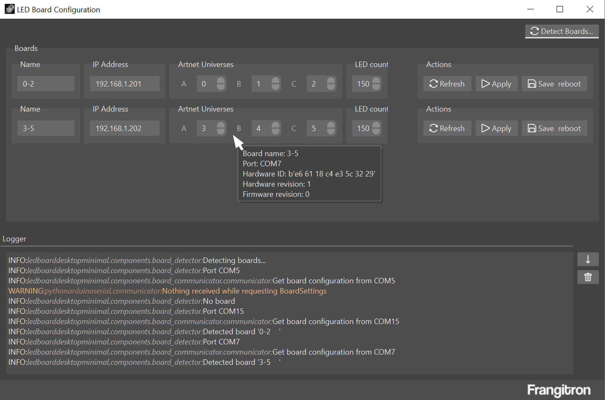

# LED Board Desktop (minimal)

Minimal version of the desktop app for LED Boards

Related projects

- [Arduino Python Serial](https://github.com/MrFrangipane/arduino-python-serial)
- [LED Board - Firmware minimal](https://github.com/MrFrangipane/ledboard-firmware-minimal)
- [LED Board - PCB](https://github.com/MrFrangipane/ledboard-pcb)
- [Python Arduino Serial](https://github.com/MrFrangipane/python-arduino-serial)

## Notes

The application icon was made by [Payungkead](https://www.flaticon.com/authors/payungkead) and found on [Flat Icon](https://www.flaticon.com)

This project uses [PySide6 helpers](https://github.com/MrFrangipane/pyside6-helpers) which icons were made by [Freepik](https://www.freepik.com/) and found on [Flat Icon](https://www.flaticon.com)
